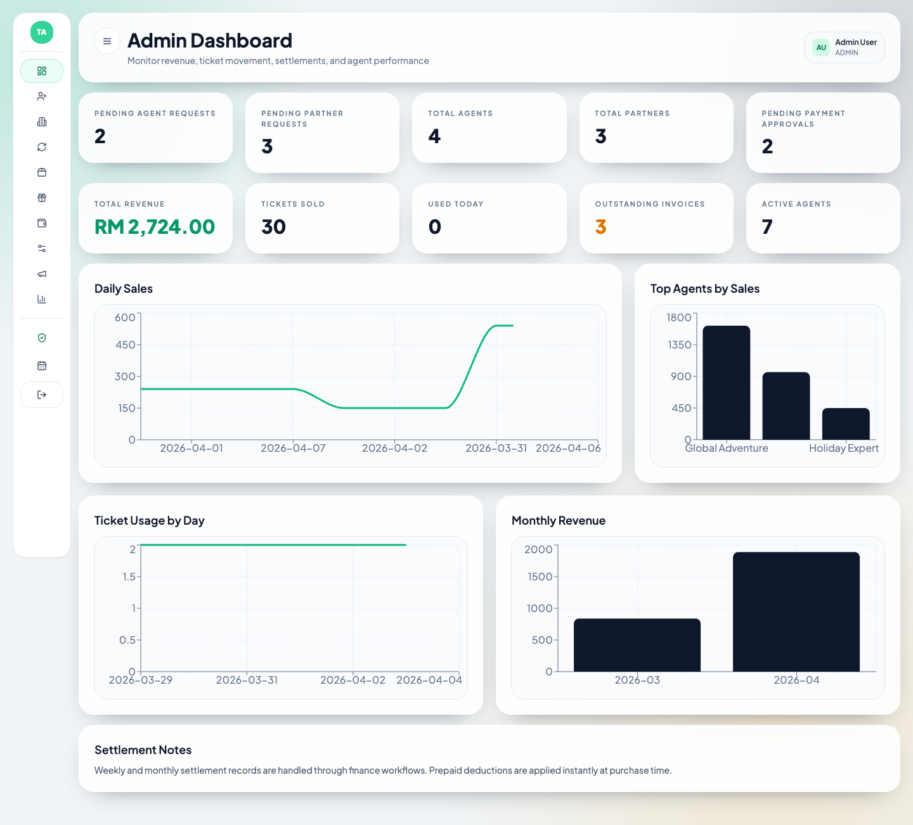
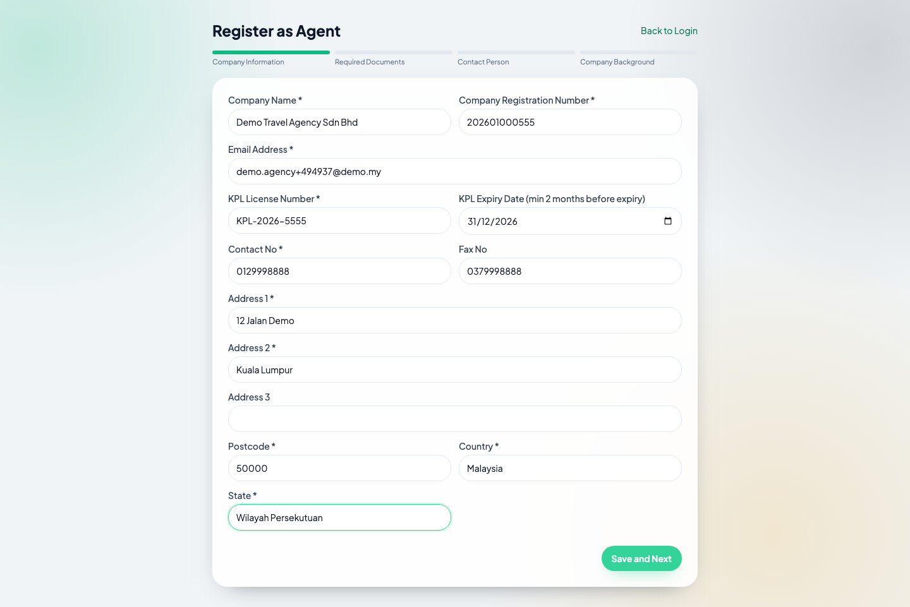
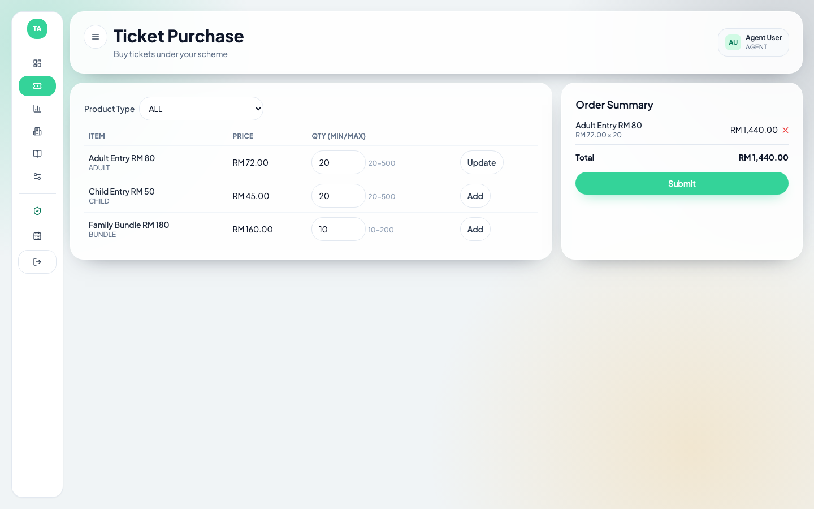
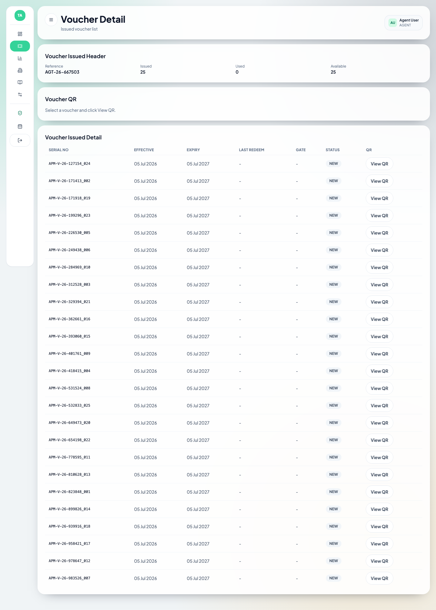

# OWG Agent Portal — Travel Agent OTA Platform

A complete B2B ticketing portal for theme-park / attraction operators: travel **agents and partners** register online, buy tickets wholesale under admin-defined pricing schemes, pay by bank transfer, receive QR vouchers, and gate **staff** redeem them — with **admin** and **finance** approval workflows in between.



## The full journey

```
Agent/Partner          Admin                Agent/Partner        Finance            Admin                Staff
─────────────          ─────                ─────────────        ───────            ─────                ─────
Register online   →    Approve request  →   Buy tickets      →   Mark payment   →   Approve payment  →   Redeem voucher
+ upload KPL/SSM       (account code +      + upload bank        as Paid            (vouchers issued     QR at the gate
docs                   temp password        transfer slip                           automatically)
                       emailed)
```

## Features

### 🏢 Agent & Partner portal
- **Self-registration** — 4-step wizard (company info, KPL/SSM document upload, contact persons, background) with T&C gate, generated Application ID, and public status checking
- **Account-code login** (`A20260001` / `P20260001`) with emailed temporary passwords (24h expiry), forced password change, and complexity rules
- **Ticket Purchase** — scheme-priced catalog with per-item min/max quantities, cart, incentives, and order summary
- **Offline Payment** — upload bank slip, choose payment group/type, track approval history
- **Voucher Issued** — per-voucher serial numbers and QR codes, issued/used/available counts, redeem status (New / Locked / Redeemed)
- **Incomplete Orders**, **Purchase/Payment reports with Excel export**, view-only company profile, **account renewal** (unlocks 2 months before expiry — expired accounts keep login but lose purchasing)
- Home-page announcement popups + dashboard announcement feed

### 🛠️ Admin portal
- **Registration approval queues** (separate Agent / Partner) — review uploaded documents, Approve / Reject / Revision with remarks; approval auto-creates the account and emails credentials
- **Purchase Schemes** — group products with custom prices, min/max, incentives; versioned revisions by effective date; bind to accounts (Standard / Special)
- **Offline Payment approval** — two-actor flow: Finance marks paid, Admin approves → vouchers generated
- **Complimentary vouchers** (min 20), **account renewals**, **announcements** (Home/Login, audience-targeted, JPG/PDF)
- **9 reports** — Transaction, Transaction Details, Purchase Summary, Purchase Details, Top Purchase, Voucher Issued, Ticket (serial/QR search), Complimentary, Payment — all with user/company/date filters, quick search, paging, TOTAL rows, and **Export To Excel**

### 💰 Finance role
- Dedicated queue to verify bank slips and **Mark Payment Paid** (a hard prerequisite before admin approval)

### 🎫 Staff (gate)
- **Voucher Redeem** screen — scan QR or type serial, optional entrance gate, one-time redemption with full rejection handling (already redeemed / expired / locked / not found)
- Legacy retail scanner + ticket list with Excel export

| Registration | Ticket Purchase | Voucher QR |
|---|---|---|
|  |  |  |

## Tech stack

| Layer | Technology |
|---|---|
| Frontend | Next.js 15 (App Router), React 19, TypeScript (strict), Tailwind CSS |
| Backend | Next.js API routes → thin controllers → **framework-free service layer** |
| Database | PostgreSQL + Prisma 6 |
| Auth | Custom JWT (jose, HS256 access + refresh in httpOnly cookies), bcrypt |
| Files | Private disk uploads (`uploads/`) + authenticated download route |
| Email | Pluggable driver (`EMAIL_DRIVER`) — console logger by default |
| Excel | exceljs (`?format=xlsx` on report endpoints) |
| QR | HMAC-signed payloads + qrcode data-URLs |

## Project structure

```
frontend/          Next.js app — pages, API routes, UI kit, hooks
  app/             routes: /admin/**, /agent/**, /finance/**, public /register/**
  components/      ui primitives, layout shells, report-shell, FileUpload
  scripts/         capture-guide.mjs (screenshot bot), export-data.mjs
backend/           framework-free business logic
  prisma/          schema.prisma, migrations, seed.ts
  services/        ★ all domain logic (registration, scheme, purchase, voucher…)
  controllers/     thin re-export objects
  middleware/      JWT auth context + role guards
shared/            cross-cutting TS types + utils
docs/
  user-guide/      illustrated HTML user guide (42 real screenshots)
  transfer/        DB schema dump, data export, QSTUDIO plugin package
uploads/           uploaded documents (gitignored)
```

## Quick start

```bash
# 1. Postgres (Docker)
docker run -d --name offline-ota-postgres -p 5432:5432 \
  -e POSTGRES_USER=travel_agent -e POSTGRES_PASSWORD=travel_agent \
  -e POSTGRES_DB=travel_agent postgres:16

# 2. Install + configure
cd frontend
npm install
cp .env.example .env.local          # set real JWT secrets

# 3. Database
npm run prisma:migrate
npm run prisma:seed

# 4. Run
npm run dev                          # http://localhost:3000
```

### Demo accounts

| Role | Username | Password |
|---|---|---|
| Admin | `admin@travel-agent.demo` | `admin123!` |
| Agent | `A20260001` | `agent123!` |
| Partner | `P20260001` | `partner123!` |
| Finance | `finance@travel-agent.demo` | `finance123!` |
| Staff | `staff@travel-agent.demo` | `staff123!` |
